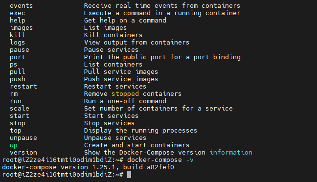

# haproxy_web

一个关于docker compose实现简单负载均衡和web应用的实验记录

# 关于Compose实现负载均衡器和web应用

## 摘要

在本实验中，使用阿里云ECS安装Docker以及Docker Compose。使用Docker Compose实现创建负载均衡器+web的应用。下面创建一下架构：一个Haproxy作为负载均衡器，后端挂载三个Web容器。

## 引言

在现代的Web应用中，使用负载均衡器来分担后端服务器的负荷已经变得非常常见。负载均衡器可以帮助我们在大流量和高并发的情况下更好地处理用户请求，提高系统的性能和可用性。

为了实现负载均衡和Web应用的结合，我们将使用Docker和Docker Compose这两个强大的工具。Docker可以帮助我们轻松创建和管理容器化的应用，而Docker Compose则允许我们以声明性的方式定义和运行多个容器。

本实验旨在通过Docker Compose实现一个简单的负载均衡器和Web应用的架构，并测试其性能和可靠性。我们将使用Haproxy作为负载均衡器，它能够根据预定的策略将用户的请求分发到后端的Web容器中。

接下来的实验过程将涵盖安装Docker和Docker Compose，编写Compose文件来定义我们的架构，并测试负载均衡器和Web应用的功能和效果。

## 实验步骤

### 步骤1：在阿里云使用CADT云速搭创建一台ECS

架构图如下：


另外我们还需要具体设置ECS配置，双击ecs。打开配置选项


主要配置支付方式、系统镜像，实例规格、密码等等。保存选择右上角部署应用

双击实例，查看实例信息，其中有ip地址，现在用ssh连接。


### 步骤二：安装Docker Engine和Docker Compose

#### 安装Docker Engine

[docker官网安装教程](https://docs.docker.com/engine/install/debian/)

根据官网介绍，我们可以使用脚本进行安装。这也是我推荐的方式


```sh
curl -fsSL https://get.docker.com -o get-docker.sh

sudo sh ./get-docker.sh
```

输入以下命令验证安装

```sh
docker -v
```
若出现版本号说明成功安装


#### 安装Docker Compose

Compose目前支持Linux和Mac OS平台，两者的安装过程大同小异。安装Compose之前需要安装docker Engine。

Compose可以通过Python的pip工具进行安装，可以直接下载编译好的二进制文件，甚至可以直接运行在容器中。前两种是传统方法，第三种方法相比前两种方案不破坏宿主环境，比较适合云计算场景。

**方法一：使用pip进行安装**

```pip
sudo pip install -U docker-compose
```

安装成功之后可以使用以下命令查看帮助信息，并且验证安装。

```sh
docker-compose -h
```

若出现帮助信息则安装成功


**添加补全命令**

```sh
sudo curl \
-L https://raw.githubusercontent.com/docker/compose/1.29.2/contrib/completion/bash/docker-compose \
 -o /etc/bash_completion.d/docker-compose
```

**方法二：使用二进制包**


```sh
# 下载
curl -L "https://github.com/docker/compose/releases/download/1.28.3/docker-compose-$(uname -s)-$(uname -m)" -o /usr/local/bin/docker-compose

# 添加执行权限
chmod +x /usr/local/bin/docker-compose
```

安装成功之后可以使用以下命令查看帮助信息，并且验证安装。

```sh
docker-compose -h
```

若出现帮助信息则安装成功

**方法三：使用容器**

Compose既然是一个Python应用，自然可以直接使用容器来执行它。

```sh
# 下载脚本
wget https://github.com/docker/compose/releases/download/1.25.1/run.sh

# 添加执行权限并且执行
chmod +x run.sh && sh run.sh
```

如果你不想sh run.sh运行则可以这样

```sh
# 下载脚本
wget https://github.com/docker/compose/releases/download/1.25.1/run.sh -O /usr/local/bin/docker-compose

# 添加执行权限并且执行
chmod +x /usr/local/bin/docker-compose
```

然后输入docker-compose，现在可以查看到容器了。

三种方式使用上并无区别

输入以下命令验证安装，若返回版本号则成功

```sh
docker-compose -v
```



## 步骤三：创建应用

首先创建一个名叫haproxy_web目录，作为项目工作目录，并且在下面新建两个文件夹：web和haproxy。

**web目录**

在web目录下面放置所需的web应用代码和Dockerfile，一会将生成需要的web镜像。

使用Python程序实现一个，可以打印出访问者ip和后端容器ip的web应用。

```python
#!/usr/bin/python
# authors: nanak <2152598815@qq.com>
# github <github.com/jiuyue112>
# update: 2023-07-15


from collections import OrderedDict
from datetime import datetime
import fcntl
from http.server import HTTPServer, SimpleHTTPRequestHandler
import pickle
import socket
import struct


class HandlerClass(SimpleHTTPRequestHandler):
	def get_ip_address(self, ifname):
		"""
		Get the IP from the network interface
		"""
		with socket.socket(socket.AF_INET, socket.SOCK_DGRAM) as s:
			return socket.inet_ntoa(fcntl.ioctl(
				s.fileno(),
				0x8915,  # SIOCGIFADDR
				struct.pack('256s', ifname[:15].encode())
			)[20:24])

	def log_message(self, format, *args):
		"""
		Generate the index.html
		"""
		try:
			request = pickle.load(open("pickle_data.txt", "rb"))
		except:
			request = OrderedDict()
		if len(args) < 3 or "200" not in args[1]:
			return

		try:
			time_now = datetime.now()
			ts = time_now.strftime('%H:%M:%S')
			host = self.address_string()
			addr_pair = (host, self.get_ip_address('eth0'))
			if addr_pair not in request:
				request[addr_pair] = [1, ts]
			else:
				num = request[addr_pair][0] + 1
				del request[addr_pair]
				request[addr_pair] = [num, ts]
			file = open("index.html", "w")
			file.write(
				"<!DOCTYPE html> <html> <body><center><h1><font color=\"blue\" face=\"Georgia, Arial\" size=8><em>HA</em></font> Webpage Visit Results</h1>")
			for pair in request:
				if pair[0] == host:
					guest = "LOCAL: " + pair[0]
				else:
					guest = pair[0]
				if (time_now - datetime.strptime(request[pair][1],
				                                 '%H:%M:%S')).seconds < 3:
					file.write("<p style=\"font-size:150%\" >" + str(
						request[pair][1]) + ": <font color=\"red\">" + str(
						request[pair][
							0]) + "</font> requests " + "from &lt;<font color=\"blue\">" + guest + "</font>>&nbsp;to WebServer &lt;<font color=\"blue\">" +
					           pair[1] + "</font>>&nbsp;</p>")
				else:
					file.write("<p style=\"font-size:150%\" >" + str(
						request[pair][1]) + ": <font color=\"maroon\">" + str(
						request[pair][
							0]) + "</font> requests " + "from &lt;<font color=\"navy\">" + guest + "</font>>&nbsp;to WebServer &lt;<font color=\"navy\">" +
					           pair[1] + "</font>>&nbsp;</p>")
			file.write("</center></body> </html>")
			file.close()
			with open('pickle_data.txt', 'wb') as handle:
				pickle.dump(request, handle, protocol=pickle.HIGHEST_PROTOCOL)
		except Exception as e:
			print("Error:", e)


if __name__ == '__main__':
	try:
		httpd = HTTPServer(('0.0.0.0', 80), HandlerClass)

		print("serving at port", 80)
		httpd.serve_forever()
	except Exception as e:
		print("Error:", e)
		exit(1)
```

**创建index.html文件并且创建Dockerfile文件**

```sh
# 空文件即可，index.py往里面写内容。你也可以写入一句话用来显示。
touch index.html
# 创建编辑Dockerfile
vim Dockerfile
```

```Dockerfile
# 这个镜像更新源为ustc源，下载更快。
FROM nanak112/debian:python3.11 
WORKDIR /code
ADD . /code
EXPOSE 80
CMD python index.py
```

保存退出，编译

```sh
docker build -t webapp:0.1 .
```

查看镜像验证是否成功

```sh
docker images
```


**haproxy目录**

创建一个haproxy.cfg文件，并在里面写入以下内容：

```config
global
  log /dev/log    local0
  log /dev/log    local1 notice
  maxconn 4096

defaults
  log global
  mode http
  option httplog
  option dontlognull
  timeout connect 5000
  timeout client 50000
  timeout server 50000

listen stats
  bind 0.0.0.0:70
  mode http
  stats enable
  stats hide-version
  stats scope .
  stats realm Haproxy\ Statistics
  stats uri /
  stats auth user:pass

frontend balancer
  bind 0.0.0.0:80
  mode http
  default_backend web_backends

backend web_backends
  mode http
  balance roundrobin
  option forwardfor
  #option httpchk GET /
  option httpchk HEAD /healthcheck.html HTTP/1.1
  server weba weba:80 check
  server webb webb:80 check
  server webc webc:80 check
```

haproxy_web下创建docker-compose.yml文件，并且写入以下内容。

```sh
# authors: nanak <2152598815@qq.com>
# github <github.com/jiuyue112>
# update: 2023-07-15

version: "3.9"
services:
    weba:
        build: ./web
        expose:
            - 80
    webb:
        build: ./web
        expose:
            - 80
    webc:
        build: ./web
        expose:
            - 80
    haproxy:
        image: haproxy:2.8
        volumes:
            - ./haproxy:/haproxy-override
            - ./haproxy/haproxy.cfg:/usr/local/etc/haproxy/haproxy.cfg:ro
        links:
            - weba
            - webb
            - webc
        ports:
            - "80:80"
            - "70:70" # haproxy admin console, login with user:pass
```